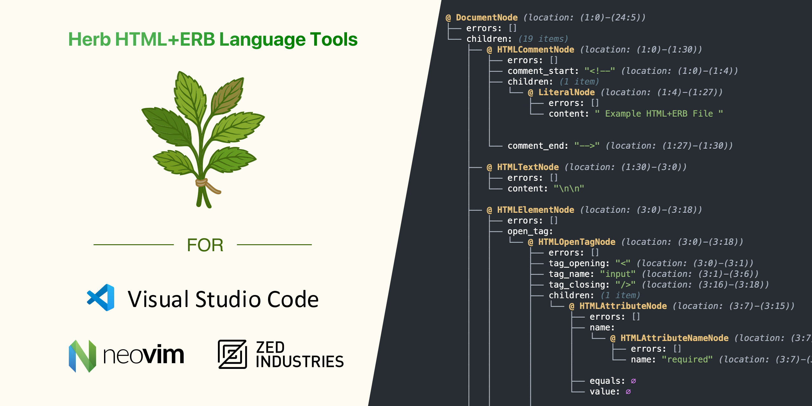

# @herb-tools/language-server

[](https://badge.fury.io/js/%40herb-tools%2Flanguage-server)
[](https://opensource.org/licenses/MIT)

Language Server Protocol (LSP) implementation for intelligent ERB development with HTML-aware parsing.



## Overview

`@herb-tools/language-server` provides a complete Language Server Protocol implementation that brings intelligent editing features to ERB templates. It leverages the Herb parser to understand both HTML structure and embedded Ruby code, enabling sophisticated IDE capabilities across any LSP-compatible editor.

## Features

### Intelligent Code Analysis
- **Syntax highlighting**: Rich, context-aware highlighting for HTML and ERB
- **Error detection**: Real-time parsing errors with precise locations
- **Warning reporting**: Best practice violations and potential issues
- **Semantic understanding**: Recognizes HTML elements, attributes, and ERB constructs

### Advanced Editor Features
- **Auto-completion**: Intelligent suggestions for HTML tags, attributes, and ERB syntax
- **Hover information**: Detailed information about elements and ERB blocks
- **Go to definition**: Navigate to ERB variable and method definitions
- **Document outline**: Hierarchical view of template structure
- **Code formatting**: Automatic indentation and whitespace management

### Performance Optimized
- **Real-time parsing**: Updates on every keystroke without lag
- **Incremental updates**: Only re-analyzes changed sections
- **Memory efficient**: Optimized for large ERB files
- **Background processing**: Non-blocking analysis and validation

## Installation

### Visual Studio Code

Install the [Herb LSP extension](https://marketplace.visualstudio.com/items?itemName=marcoroth.herb-lsp) from the Visual Studio Marketplace.

```bash
# Via command palette
# Ctrl+Shift+P -> "Extensions: Install Extensions" -> Search "Herb LSP"

# Or via command line
code --install-extension marcoroth.herb-lsp
```

### Cursor (Open VSX Registry)

Install the [Herb LSP extension](https://open-vsx.org/extension/marcoroth/herb-lsp) from the Open VSX Registry.

### Zed

The Herb Language Server is integrated into the official [Ruby extension for Zed](https://github.com/zed-extensions/ruby). Install the Ruby extension and ERB support is automatically enabled.

**Installation in Zed:**
1. Open command palette (`Cmd+Shift+P` / `Ctrl+Shift+P`)
2. Type "zed: extensions"
3. Search for "Ruby" and install

Read more in the [Zed Ruby documentation](https://zed.dev/docs/languages/ruby).

### Neovim

#### Using `nvim-lspconfig` (Recommended)

Support for Herb Language Server is being added to nvim-lspconfig. See [PR #3925](https://github.com/neovim/nvim-lspconfig/pull/3925) for progress.

Once merged, you'll be able to configure it like this:

```lua
require('lspconfig').herb_ls.setup{}
```

#### Manual Setup

For immediate use, configure manually:

```lua
local lspconfig = require('lspconfig')
local configs = require('lspconfig.configs')

-- Define the server configuration
if not configs.herb_ls then
  configs.herb_ls = {
    default_config = {
      cmd = { 'herb-language-server', '--stdio' },
      filetypes = { 'eruby', 'erb' },
      root_dir = lspconfig.util.root_pattern('.git', 'Gemfile'),
      settings = {},
    },
    docs = {
      description = [[
Herb Language Server for ERB templates with HTML-aware parsing.
]],
    },
  }
end

-- Setup the language server
lspconfig.herb_ls.setup{}
```

### Vim

#### Using CoC

Add to your `coc-settings.json`:

```json
{
  "languageserver": {
    "herb": {
      "command": "herb-language-server",
      "args": ["--stdio"],
      "filetypes": ["eruby", "erb"],
      "rootPatterns": [".git", "Gemfile"]
    }
  }
}
```

#### Using ALE

Add to your `.vimrc`:

```vim
let g:ale_linters = {
\   'eruby': ['herb-ls'],
\}

let g:ale_erb_herb_ls_executable = 'herb-language-server'
let g:ale_erb_herb_ls_options = '--stdio'
```

### Sublime Text

#### Using LSP Package

1. Install the [LSP package](https://packagecontrol.io/packages/LSP)
2. Add to your LSP settings:

```json
{
  "clients": {
    "herb-ls": {
      "enabled": true,
      "command": ["herb-language-server", "--stdio"],
      "selector": "source.erb | text.html.erb"
    }
  }
}
```

### Manual Installation

Install globally via npm or yarn to use with any LSP-compatible editor:

#### NPM (Global)

```bash
npm install -g @herb-tools/language-server
```

#### Yarn (Global)

```bash
yarn global add @herb-tools/language-server
```

#### NPX (No Installation)

```bash
npx @herb-tools/language-server --stdio
```

### Running the Language Server

The language server supports multiple communication methods:

```bash
# Standard input/output (most common)
herb-language-server --stdio

# Node.js IPC
herb-language-server --node-ipc

# TCP socket
herb-language-server --socket=8080
```

## Configuration

### VS Code Settings

Configure the extension through VS Code settings:

```json
{
  "herb.languageServer.enabled": true,
  "herb.languageServer.trace.server": "verbose",
  "herb.diagnostics.enabled": true,
  "herb.formatting.enabled": true,
  "herb.completion.enabled": true
}
```

### Language Server Settings

Configure via LSP `initializationOptions`:

```json
{
  "diagnostics": {
    "enabled": true,
    "maxProblems": 100,
    "severity": {
      "parseError": "error",
      "htmlError": "warning",
      "erbError": "error"
    }
  },
  "completion": {
    "enabled": true,
    "triggerCharacters": ["<", "%", "=", " "]
  },
  "formatting": {
    "enabled": true,
    "indentSize": 2,
    "preserveWhitespace": true
  }
}
```

## Features in Detail

### Syntax Highlighting

The language server provides rich semantic highlighting that understands the relationship between HTML and ERB:

- **ERB delimiters**: `<%`, `<%=`, `<%#`, `%>`
- **Ruby code**: Full syntax highlighting within ERB blocks
- **HTML structure**: Tags, attributes, and content
- **Mixed content**: Accurate highlighting of ERB within HTML attributes

### Error Detection

Real-time error detection with detailed diagnostics:

```erb
<!-- Parse errors -->
<div><% if user %><%= user.name %></div>  <!-- Missing <% end %> -->

<!-- HTML validation -->
">  <!-- Missing alt attribute warning -->

<!-- ERB syntax issues -->
<%= broken_ruby syntax %>  <!-- Ruby syntax error -->
```

### Auto-completion

Intelligent completions based on context:

- **HTML tags**: Standard HTML5 elements with attributes
- **ERB syntax**: Complete ERB blocks and expressions
- **Ruby keywords**: Within ERB blocks
- **Custom helpers**: Rails and application-specific methods

### Document Outline

Hierarchical view of template structure:

```
📄 user_profile.html.erb
├── 🏷️  div.user-profile
│   ├── 🔀 if user.admin?
│   │   └── 🏷️  span.badge
│   ├── 🏷️  h2
│   │   └── 📝 <%= user.name %>
│   └── 🏷️  p
│       └── 📝 <%= user.bio || "No bio" %>
└── 🔀 if user.posts.any?
    └── 🏷️  ul.posts
        └── 🔁 user.posts.each
            └── 🏷️  li
```

### Hover Information

Detailed information on hover:

- **HTML elements**: MDN documentation, accessibility info
- **ERB variables**: Type information, definition location
- **Ruby methods**: Documentation and signatures
- **Performance hints**: Optimization suggestions

## Development

### Building from Source

```bash
# Clone the repository
git clone https://github.com/marcoroth/herb.git
cd herb/javascript/packages/language-server

# Install dependencies
npm install

# Build the language server
npm run build
```

### Development Workflow

```bash
# Watch mode for development
npm run watch

# Test the language server
npm test

# Run locally
node ./dist/index.js --stdio
```

### Project Structure

```
src/
├── index.ts              # Main entry point
├── server.ts             # LSP server implementation
├── service.ts            # Language service logic
├── diagnostics.ts        # Error and warning detection
├── document_service.ts   # Document management
├── config.ts             # Configuration handling
├── utils.ts              # Utility functions
└── cli.ts                # Command-line interface
```

### Testing with Different Editors

#### VS Code Development

1. Open the project in VS Code
2. Press `F5` to launch Extension Development Host
3. Open an ERB file to test functionality

#### Manual Testing

```bash
# Start language server
npm run build
node ./dist/index.js --stdio

# Send LSP messages (via stdin)
{"jsonrpc":"2.0","id":1,"method":"initialize","params":{"capabilities":{}}}
```

## API Reference

### Language Server Protocol Support

#### Text Document Synchronization
- `textDocument/didOpen`
- `textDocument/didChange`
- `textDocument/didClose`
- `textDocument/didSave`

#### Language Features
- `textDocument/completion` - Auto-completion
- `textDocument/hover` - Hover information
- `textDocument/signatureHelp` - Signature help
- `textDocument/definition` - Go to definition
- `textDocument/documentSymbol` - Document outline
- `textDocument/formatting` - Document formatting
- `textDocument/rangeFormatting` - Range formatting

#### Diagnostics
- `textDocument/publishDiagnostics` - Error and warning reporting

### Custom Methods

#### `erb/extractRuby`
Extract Ruby code from ERB template:

```json
{
  "jsonrpc": "2.0",
  "method": "erb/extractRuby",
  "params": {
    "uri": "file:///path/to/template.erb"
  }
}
```

#### `erb/extractHTML`
Extract HTML structure from ERB template:

```json
{
  "jsonrpc": "2.0",
  "method": "erb/extractHTML",
  "params": {
    "uri": "file:///path/to/template.erb"
  }
}
```

## Performance

### Benchmarks

Based on typical ERB files:

- **Initialization**: ~50ms
- **Document parsing**: ~5ms for 1000-line files
- **Completion**: ~1ms response time
- **Memory usage**: ~50MB for large projects

### Optimization Tips

1. **File watching**: Language server only processes open files
2. **Incremental parsing**: Only changed regions are re-analyzed
3. **Caching**: Parse results cached until file changes
4. **Background processing**: Analysis runs in separate thread

## Troubleshooting

### Common Issues

#### Language Server Not Starting

```bash
# Check if installed correctly
which herb-language-server

# Test manual execution
herb-language-server --stdio
# Should show: "Content-Length: ..." messages
```

#### No Syntax Highlighting

1. Verify file is recognized as ERB (`.erb` extension)
2. Check editor's file association settings
3. Restart language server: reload editor window

#### Performance Issues

```bash
# Enable verbose logging
herb-language-server --stdio --verbose

# Monitor resource usage
top -p $(pgrep herb-language-server)
```

### Debug Mode

Enable debug logging:

```json
{
  "herb.languageServer.trace.server": "verbose"
}
```

Check debug output in editor's Output panel (VS Code) or equivalent.

### Logs Location

- **VS Code**: Output panel → "Herb Language Server"
- **Neovim**: `:LspLog`
- **Manual**: stderr output when running with `--stdio`

## Contributing

See the main [Herb contributing guide](../../../CONTRIBUTING.md) for development setup and contribution guidelines.

### Language Server Development

1. Make changes to TypeScript source in `src/`
2. Run `npm run build` to compile
3. Test with `npm test` or manual LSP client
4. Submit pull request

### Adding New Features

1. Implement LSP method in `src/server.ts`
2. Add logic to `src/service.ts`
3. Update documentation
4. Add tests

## Related Projects

- **[Herb Parser](../../../)**: Core HTML+ERB parsing library
- **[VS Code Extension](../vscode/)**: VS Code-specific extension wrapper
- **[@herb-tools/core](../core/)**: TypeScript type definitions
- **[@herb-tools/node-wasm](../node-wasm/)**: WebAssembly backend used by this package

## License

MIT License - see [LICENSE](../../../LICENSE.txt) for details.